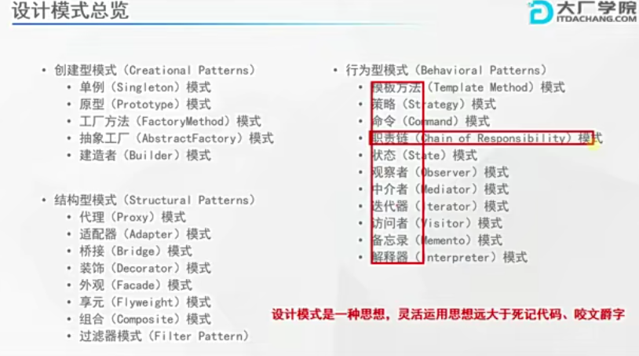
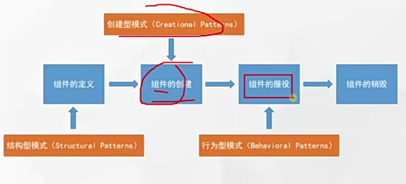
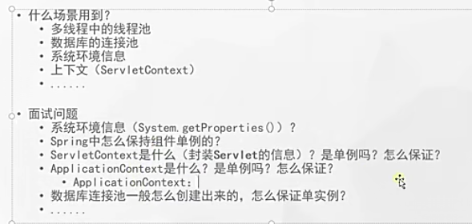
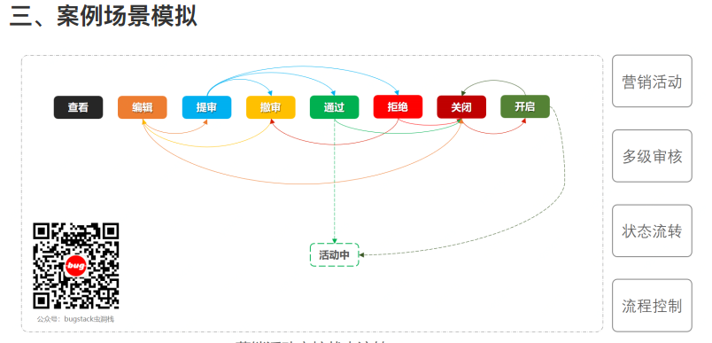

### 一，设计模式概述

#### 1，设计模式是什么？

参考：https://blog.csdn.net/ShuSheng0007/article/details/115980889

1）设计模式是什么？

设计模式是水平较高且经验丰富的程序员总结出来的代码编写策略，类似于打游戏的攻略，如玩暗黑2的话，知道哪些攻略就能更好的通关。

常见的23种设计模式：分为三种大类型

一，创建型模式：单例模式，抽象工厂模式，建造者模式，原型模式，工厂模式；

二，结构型模式：适配器模式，桥接模式，装饰者模式，组合模式，外观模式，享元模式，代理模式；

三，行为型模式：模板方法模式，命令模式，访问者模式，迭代器模式，观察者模式，中介者模式，备忘录模式，解释器模式(Interpreter模式)，状态模式，策略模式，职责链模式(责任链模式)。

2）为什么学习设计模式？注意事项？

让代码简洁，减少写的烂代码，让代码更好维护和高效。

设计模式只是一种面向对象编程的思路，实现方式有很多种，没必要完全死板按照23种设计模式的固定写法，一点不差，只要整体思路符合这个类型的设计模式即可。

**七大原则遵守注意**：不一定完全遵守七大原则，完全照搬，如果按照这些原则反而让程序复杂的化，就不要用。

3）设计原则核心思想

GOF的建议：
对接口变成而不是对实现编程；
优先使用对象的组合而不是继承（使用组合的管理）；


4) 如何学习设计模式？

首先要明白这种设置模式是什么。如果开始不理解，就看看多个案例，先总结下，根据人家的代码范例来画画UML图。然后试着在原有的代码上增加扩展，就能体会到扩展性，进而才能理解这个设计模式。

5)设计在开发功能阶段的使用时机？





#### 2，UML图符号含义


#### 3，Aggregation聚合的含义

如果A类中有个成员变量B，在A中通过set(B b)方法给其赋值，那这两个类就是聚合的。

#### 4，StarUML使用相关

如果StarUML下不动Java插件，改为管理员模式启动

### 二，23种设计模式

#### 1，单例模式

1）什么是单例模式？

就是整个项目中只允许这个类只创建一个实例。

单例是一种思想，根据特定的需求创建单例，不一定只有代码范例的那集中。

2）为什么使用单例模式？

防止实例对象创建过多造成项目运行缓慢。

3）单例应用范例？

线程池，数据库连接池，JedisPool（Redis数据库连接池），这些链接池只需要创建一个实例就行了，如果每个接口链接数据库，创建线程都新建一个池的实例势必会造成项目占用内存，CPU等过多导致运行缓慢。



#### 2，工厂模式

1）工厂模式的意义？

将分布在项目中各个地方实例化对象的代码提取出来，放到工厂类的代码里，进行统计管理和维护，使之和主项目依赖解耦，进而提高了项目的扩展和维护性。

2）为什么使用工厂模式？

1. 你不想直接**new**这个类的对象，怕以后这个类改变的时候你需要回来改代码，而此时依赖这个类的地方已经到处都是了。
2. 这个类的对象构建过程非常复杂，你不愿意将这么复杂的构建过程一遍又一遍的写在需要用到此对象的地方。
3. 这个类的对象在构建过程中依赖了很多其他的类，而你无法在调用的地方提供。

3）工厂模式范例？

JDK : Calender类里，createCalendar()方法 ,  NumberFormat.java , SimpleDateFormat

各大框架的： LoggerFactory, SqlSessionFactory(MyBatis), BeanFactory(Spring)


 **4)  三种工厂方法的区别 ?**
 简单工厂（一个方法）：使用使用if-else来区分判断不同的对象。
 工厂方法（很多方法）：每个产品或每类产品一个方法。
 抽象工厂：很多工厂+很多方法。

#### 3，建造者模式

**什么是建造者模式？**

官方定义，比较难懂：
 将一个复杂对象的构建与其表示分离，使得同样的构建过程可以创建不同的表示 。

**个人理解：**

建造者模式指对象的每个建造细节都可以传入参数，但都不是必须的，如果是必须的则用构造器强制加入。

一个对象的构建步骤相同，但是属性参数不同，需要创建不同的参数值的对象，注重和针对是内部复杂参数值的变化。即创建对象的步骤或所需参数比较复杂，但是还要暴露部分参数设置给用户。参照范例代码HttpClient中建造RequestConfig的范例。

##### 3.1, 工厂模式和建造者模式的区别？

工厂模式是针对整体对象的创建，创建的对象是一个整体，产生的对象内部值都是一样的。

而建造者模式是针对不同参数值对象的创建，注重的是内部复杂的参数的合理创建，每次根据要求创建具有不同属性值内部参数等的对象。

#### 4，适配器模式

1） 什么是适配器模式？

适配器就是用来链接两个不同的接口。

2）适配器范例？

SpringMVC中的适配器的用法：
为每个不用类型的请求Controller(也叫Handler)配上不同的适配器(HandlerAdapter)，相应的适配器里代替各自的Controller执行相应的方法。


#### 5，桥接模式

1）什么是桥接模式？

链接同一个东西的两个不同维度。

#### 6，享元模式(Flyweight)

(1)什么是享元模式？

享元：享，指的是共享，元，指的是一个微小的单元。

Flyweight是轻量级的意思

(2)为什么使用享元模式？

指通过尽可能的共享实例来避免new实例，减少代码的重复。

(2)使用范例

数据库连接池，线程池，缓冲池，String常量池，Integer的byte常量池等都使用了享元模式

#### 7，代理模式

(1)什么是代理模式？

简单的说就是用一个代理类来代替另一个类实现其方法

(2)为什么使用代理模式？

- 可为被代理的方法增加一些功能，如打印日志，限制权限等
- 减少内存开销，因为代理模式是使用到对象时才利用反射机制创建，不用预先加载。

#### 8，模板方法模式

Template Method Pattern

(1)什么是模板方法模式？

指在一个抽象的父类中，有一个自己已实现的方法，在这个方法里规定好了程序或者本类中别的方法的执行顺序。其他的方法都是抽象方法，由子类根据需求去实现，但这些方法的执行顺序都得按照父类的这个模板方法中规定的来。

外部调用都是调用父类引用所指向的方法，根据多态可能会使用不同子类中实现的抽象方法。

**总结：父类中定义了一个大方法，里面按规定顺序调用小方法，而小方法交由子类实现。**

(2)为什么使用模板方法？什么情况下使用？

当一个功能中的多个步骤都相同时，为了避免写重复代码，可使用模板方法来提高效率简化步骤。

#### 9，命令模式

Command Pattern

(1)什么是命令模式？

命令模式让调用者和执行者之间实现了解耦。

用户发布命令-->Command(传达命令)-->执行命令者，由此实现了用户这个发布命令者和执行命令着之间的解耦。

命令发布者和命令执行者之间的解耦是通过命令这个对象实现的，即把一个个具体的命令设计成类然后实例化对象来调用命令，这样实现了解耦。

(2)为什么用命令模式？

由上个答案可知，为了让发布命令者和执行命令者之间减少耦合。

(3)命令模式使用场景？

- 当需要将各种执行的动作抽象出来，使用时通过不同的参数来决定执行哪个对象
- 当某个或者某些操作需要支持撤销的场景
- 当要对操作过程记录日志，以便后期通过日志将操作过程重新做一遍时（记录历史操作，方便以后重复）。
- 当某个操作需要支持事务操作的时候

(4)命令模式优缺点？

优点：

- 发布命令和执行命令的解耦了，如需增加新的命令很容易，只需要新写个Command的实现类即可，符合OCP原则，对扩展开发，扩展更容易了。
- 容易实现序列操作，例，个人范例中MacroCommand 中execute()方法
- 可以实现回调，因为java中不支持把方法作为实参，所以这里的命令类的对象当作实参，这个实参可调用方法1，这就实现了方法1的回调。
  java中的回调范例参考：https://cloud.tencent.com/developer/article/1676582

缺点：因为每增加一个命令就得增加一个类，容易造成类过多。

#### 10，访问者模式

Visitor Pattern

(1)什么是访问者模式？

访问者模式是指在不改变一个元素内部结构的前提下，创建多个访问者类，实现多种的功能。

例如，

1，一个Manager想要知道公司内两个员工的id,name,level，而一个Customer想要知道连个员工的姓名和电话，至于id,level客户不想知道。但是又想通过它里面的show方法来查看我需要的信息。不使用访问者模式就是再增加一个方法到CompanyStructure里，只循环展示员工的姓名和电话给顾客看。我不想改变CompanyStructure内的代码，因为违反OCP原则，所以使用访问者模式，在员工类里增加一个方法作为接口，接收访问者。而有几个员工就在Visitor里写几个重载的方法，因为员工数量固定，CompanyStructure也固定了没有被修改内部代码。

2，假如再来一个访问者，例如外面卖保险的，我只要电话就行了，我不需要什么名字，什么级别。就直接实现Visitor接口就行，然后把两个visit方法重写一下，只写getName()即可。由此实现了访问不同数据，不同代码功能的实现而不去更改 CompanyStructure和这两个员工


(2)访问者模式优缺点？

* 优点：

  访问者模式是指在不改变一个元素内部结构的前提下，创建多个访问者类，实现多种的功能。
  
* 缺点：

  1，具体元素对访问者公开了内部细节，违背了我迪米特原则。

  2，违背了依赖倒转原则，访问者依赖的是具体的类，不是抽象类或接口，

  当增加一个新类时，访问者内部的代码需要改动。

#### 11，迭代器模式

**Iterator**

1)什么是迭代器模式？

指为一个集合，或数组等对象提供一个遍历的方式，提供统一的遍历接口(然后写不同的Iterator实现类来遍历对应的数组或集合)，无论原类中是数组还是集合。这种方式不暴露对象的内部数据结构，操作安全。

2)为什么使用迭代器模式？

因为如果把内部结构暴露出来很可能会有用户修改，这样会引起其他人使用不便。使用迭代器可避免此问题。

而且使用者却不用关心这些内部结构是数组还是集合，树，图什么的，这就是迭代器的妙处所在 。

3)迭代器模式使用范例？

Java中集合使用的Iterator就是迭代器模式。

#### 12，观察者模式

**Observer Pattern**

1) 什么是观察者模式？

观察者模式也称订阅-发布模式，指当一个地方发布新的消息时，可以及时通知到它的观察者。

2) 为什么使用观察者模式？

如果使用普通方式实现这种发布消息功能，如果增加一个观察者，就得修改发布消息类内部的代码。
使用观察者模式的情况下则直接调用add(..)方法即可，符OCP原则。

3) 观察者使用范例？

JDK中的Observable, Observer。
RabbitMQ消息发布订阅也用到了观察者模式。

#### 13，中介者模式

**Mediator Pattern**

1) 什么是中介者模式?

 中介者模式是一种行为型模式，旨在提供一个中介者，把原来各对象之间互相依赖的网状关系改成都依赖中介者的星型关系，使各对象之间的解耦。

总结：把网状的关系编程星状的。

2) 为什么使用中介者模式？

让各对象之间解耦，方便扩展新的对象。

3) 中介者模式使用范例？

Eureka ? ORM框架如MyBatis等。

#### 14，备忘录模式

**Memento Pattern**

1) 什么是备忘录模式？

对于一个对象Originator，需要记录下它内部属性数据在某个时间点的状态。例如，一个游戏要保存分数进度等，下次再用的时候恢复这种状态。
 在不破坏封闭的前提下使用一个 Memento类来捕获一个对象的内部状态，并在该对象之外保存这个状态，从而可以将对象恢复到原先保存的状态 。

总结：把复杂对象的关键属性值保存起来以供恢复。

2) 为什么使用备忘录模式？

为了恢复一种指定的状态。

3)  使用范例？

#### 15，解释器模式

**Interpreter Pattern**

1) 什么是解释器模式？

高级语言的编译器就是使用了编译器模式，把一种语句按照固定语法翻译中另外一种比较明白的语言。

2) 为什么用解释器模式？

为了把固定格式的语言解析，返回给调用者一个它能理解的结果。

3) 解释器模式范例？

应用场景：运算表达式，编译器，正则表达式，机器人等。

Spring框架中SpelExpression

```java
import org.springframework.expression.Expression;
import org.springframework.expression.spel.standard.SpelExpression;
import org.springframework.expression.spel.standard.SpelExpressionParser;

public class SpringTest{
    public static void main(String[] args){
        SpelExpressionParser parser = new SpelExpressionParser();
        //Spring框架种的解释中缀表达式并获取结果
        Expression expression = parser.parseExpression("10 * 2 + 3"); 
        Object value = expression.getValue();
        System.out.println("value==>" + value);
    }
}
		
```

#### 16，策略模式

Strategy  Pattern

1) 什么是策略模式？

 策略模式定义了一系列的算法，并将每一个算法封装起来，使他们可以相互替换。 (官方解释)

2) 为什么用策略模式？什么情况下用？

当项目中一个操作有多种的实现方法，需要用很多if-else if判断的时候，可以用此策略模式，优化代码。
比如优惠券有现金优惠，打折优惠等，后台计算价格可采用策略模式，一个优惠方式一个策略，在策略模式类里计算好优惠价格返回给调用方。

3)  策略模式范例？


#### 17，状态模式

1) 什么是状态模式？

 当一个对象内在状态改变时允许改变其行为，这个对象看起来像是改变了其类。 (官方定义)。

个人理解：把状态用类来表示，一个状态对应一个类，而不是在代码里用if else表示。

2) 策略模式和状态模式的区别是什么？

状态模式与策略模式的UML类图都是一样的，从表面上看他们非常相似。特别是将状态切换任务放在Context中做的时候就更像了，但是其背后的思想却非常不同。

- **策略模式**定义了一组可互相代替的算法，这一组算法对象完成的是同一个任务，只是使用的方式不同。
- **状态模式**不同的状态完成的任务完全不一样。

3) 状态模式应用范例？

参照《设计模式学习指导》



#### 18，外观模式

1) 什么是外观模式？

把多个类的多个方法合成到一个类里面引用。

#### 19，职责链模式

Chain of responsibility

1) 什么是职责链模式？

处理请求有一系列对象，形成一个链条，如果这个处理完了则交给下一个处理。

官方定义： 避免请求发送者与接收者耦合在一起，让多个对象都有可能接收请求，将这些对象连接成一条链，并且沿着这条链传递请求，直到有对象处理它为止 

2) 职责链模式范例？

Tomcat中的Filter