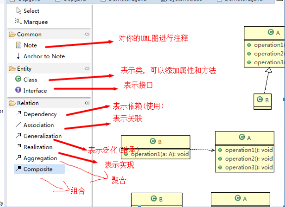
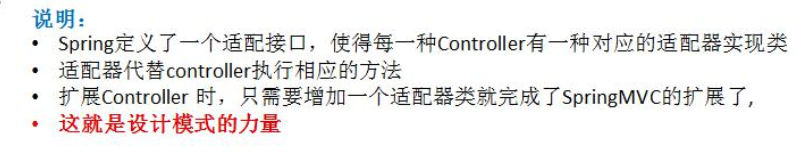
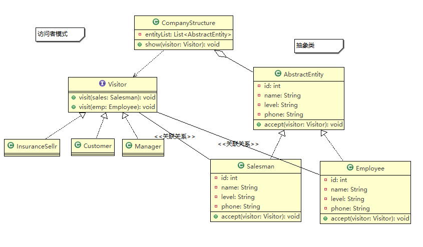

#### 1，设计模式是什么？

参考：https://blog.csdn.net/ShuSheng0007/article/details/115980889

1）设计模式是什么？

设计模式是水平较高且经验丰富的程序员总结出来的代码编写策略，类似于打游戏的攻略，如玩暗黑2的话，知道哪些攻略就能更好的通关。

常见的23种设计模式：分为三种大类型

一，创建型模式：单例模式，抽象工厂模式，建造者模式，原型模式，工厂模式；

二，结构型模式：适配器模式，桥接模式，装饰者模式，组合模式，外观模式，享元模式，代理模式；

三，行为型模式：模板方法模式，命令模式，访问者模式，迭代器模式，观察者模式，中介者模式，备忘录模式，解释器模式(Interpreter模式)，状态模式，策略模式，职责链模式(责任链模式)。

2）为什么学习设计模式？注意事项？

让代码简洁，减少写的烂代码，让代码更好维护和高效。

设计模式只是一种面向对象编程的思路，没必要完全死板按照23种设计模式的写法，一点不差，只要整体思路符合这个类型的设计模式即可。

3）设计原则核心思想

4) 如何学习设计模式？

首先要明白这种设置模式是什么。如果开始不理解，就看看多个案例，先总结下，根据人家的代码范例来画画UML图。然后试着在原有的代码上增加扩展，就能体会到扩展性，进而才能理解这个设计模式。

#### 2，UML图符号含义

#### 3，Aggregation聚合的含义

如果A类中有个成员变量B，在A中通过set(B b)方法给其赋值，那这两个类就是聚合的。

#### 4，StarUML使用相关

如果StarUML下不动Java插件，改为管理员模式启动

#### 5，工厂模式

工厂模式的意义？

把实例化对象的代码提取出来，放到工厂类的代码里，进行统计管理和维护，使之和主项目依赖解耦，进而提高了项目的扩展和维护性。

工厂方法模式：

为什么使用工厂模式？

1. 你不想直接**new**这个类的对象，怕以后这个类改变的时候你需要回来改代码，而此时依赖这个类的地方已经到处都是了。
2. 这个类的对象构建过程非常复杂，你不愿意将这么复杂的构建过程一遍又一遍的写在需要用到此对象的地方。
3. 这个类的对象在构建过程中依赖了很多其他的类，而你无法在调用的地方提供。

#### 6，建造者模式

**什么是建造者模式？**

官方定义，比较难懂

 The intent of the Builder design pattern is to separate the construction of a complex object from its representation. By doing so the same  construction process can create different representations.
 将一个复杂对象的构建与其表示分离，使得同样的构建过程可以创建不同的表示 。

**个人理解：**

一个对象的构建步骤相同，但是属性参数不同，需要创建不同的参数值的对象，注重和针对是内部复杂参数值的变化。

#### 6.1, 工厂模式和建造者模式的区别？

工厂模式是针对整体对象的创建，创建的对象是一个整体，产生的对象内部值都是一样的。

而建造者模式是针对不同参数值对象的创建，注重的是内部复杂的参数的合理创建，每次根据要求创建具有不同属性值内部参数等的对象。

#### 7，适配器模式

SpringMVC中的适配器的用法：

为每个不用类型的请求Controller(也叫Handler)配上不同的适配器(HandlerAdapter)，相应的适配器里代替各自的Controller执行相应的方法。

#### 8，桥接模式

#### 9，享元模式(Flyweight)

(1)什么是享元模式？

享元：享，指的是共享，元，指的是一个微小的单元。

Flyweight是轻量级的意思

(2)为什么使用享元模式？

指通过尽可能的共享实例来避免new实例，减少代码的重复。

(2)使用范例

数据库连接池，线程池，缓冲池，String常量池，Integer的byte常量池等都使用了享元模式

#### 10，代理模式

(1)什么是代理模式？

简单的说就是用一个代理类来代替另一个类实现其方法

(2)为什么使用代理模式？

- 可为被代理的方法增加一些功能，如打印日志，限制权限等
- 减少内存开销，因为代理模式是使用到对象时才利用反射机制创建，不用预先加载。

#### 11，模板方法模式

Template Method Pattern

(1)什么是模板方法模式？

指在一个抽象的父类中，有一个自己已实现的方法，在这个方法里规定好了程序或者本类中别的方法的执行顺序。其他的方法都是抽象方法，由子类根据需求去实现，但这些方法的执行顺序都得按照父类的这个模板方法中规定的来。

外部调用都是调用父类引用所指向的方法，根据多态可能会使用不同子类中实现的抽象方法。

(2)为什么使用模板方法？什么情况下使用？

当一个功能中的多个步骤都相同时，为了避免写重复代码，可使用模板方法来提高效率简化步骤。

#### 12，命令模式

Command Pattern

(1)什么是命令模式？

命令模式让调用者和执行者之间实现了解耦。

用户发布命令-->Command(传达命令)-->执行命令者，由此实现了用户这个发布命令者和执行命令着之间的解耦。

命令发布者和命令执行者之间的解耦是通过命令这个对象实现的，即把一个个具体的命令设计成类然后实例化对象来调用命令，这样实现了解耦。

(2)为什么用命令模式？

由上个答案可知，为了让发布命令者和执行命令者之间减少耦合。

#### 13，访问者模式

Visitor Pattern

(1)什么是访问者模式？

访问者模式是指在不改变一个元素内部结构的前提下，创建多个访问者类，实现多种的功能。

例如，

1，一个Manager想要知道公司内两个员工的id,name,level，而一个Customer想要知道连个员工的姓名和电话，至于id,level客户不想知道。但是又想通过它里面的show方法来查看我需要的信息。不使用访问者模式就是再增加一个方法到CompanyStructure里，只循环展示员工的姓名和电话给顾客看。我不想改变CompanyStructure内的代码，因为违反OCP原则，所以使用访问者模式，在员工类里增加一个方法作为接口，接收访问者。而有几个员工就在Visitor里写几个重载的方法，因为员工数量固定，CompanyStructure也固定了没有被修改内部代码。

2，假如再来一个访问者，例如外面卖保险的，我只要电话就行了，我不需要什么名字，什么级别。就直接实现Visitor接口就行，然后把两个visit方法重写一下，只写getName()即可。由此实现了访问不同数据，不同代码功能的实现而不去更改 CompanyStructure和这两个员工

